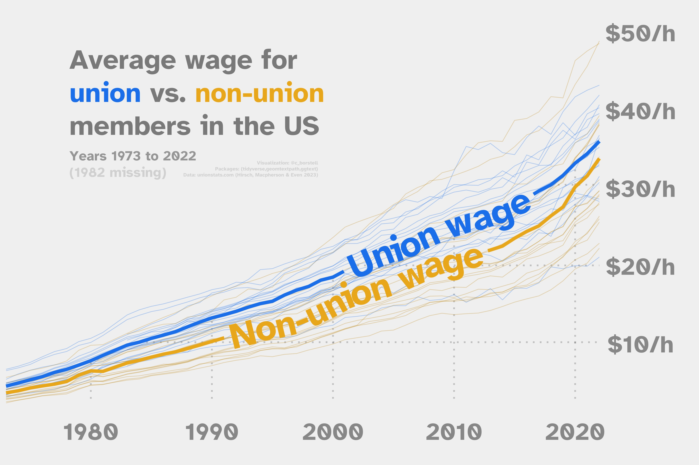

Alt-text: A line graph on a light grey background. Two thicker lines in blue and yellow increase over time, from under $10/h to around $35/h. The blue line, which is higher, reads "Union wage" and the lower yellow line reads "Non-union wage". Title reads: "Average wage for union vs.non-union members in the US: Years 1973 to 2022 (1982 missing)". Caption reads: "Visualization: @c_borstell; Packages: {tidyverse,geomtextpath,ggtext}; Data: unionstats.com (Hirsch, Macpherson & Even 2023)"
