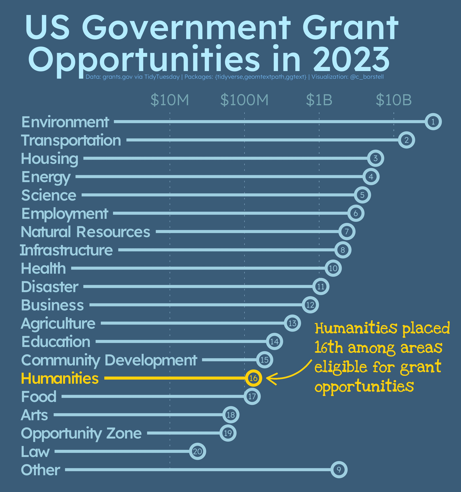

# Alt-text: A graphic on a grayish blue background showing the areas eligible for US Government Grant Opportunities in 2023 by total funding, ranked from top to bottom as horizontal bars. Environment is at the top with $30 billion. Humanities in place 16 is highlighted in gold and the annotation next to it says "Humanities placed 16th among areas eligible for grant opportunities".
