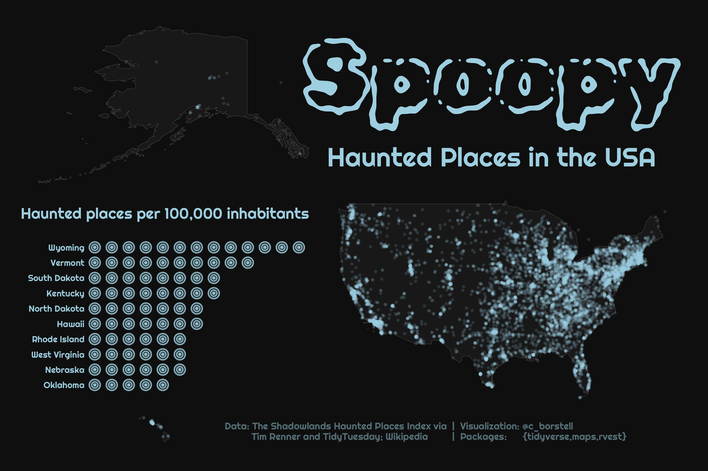

Alt-text: A graphic showing a map of mainland USA (right) with Alaska (top left) and Hawai'i (bottom left) with superimposed dots showing locations of haunted places. The background is dark, with text and dots in a spooky blue color. The title reads "Spoopy: Haunted places in the USA". On the left, between Alaska and Hawai'i, there is a horizontal bar chart showing the top 10 states ranked by number of haunted places per 100,000 inhabitants, topped by Wyoming.
