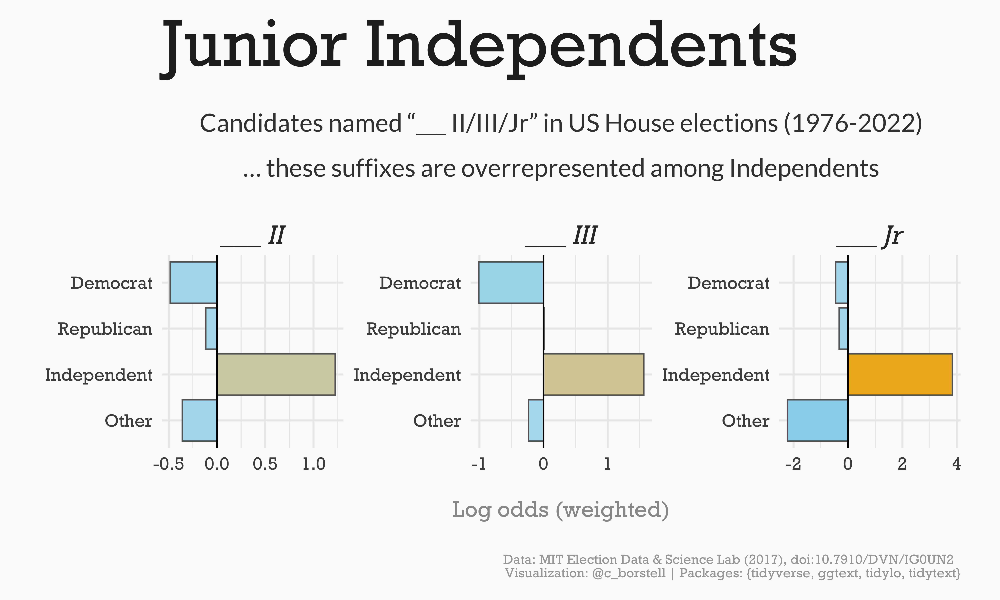

Alt-text: A bar plot with the title "Junior Independents: Candidates named "___ II/III/Jr" in US House elections (1976-2022)", showing that among Democrat, Republican, Independent and Other candidates in US House elections, the name suffixes II, III and Jr are oveerrepresented among Independents (using a weighted log odds metric). The bars are horizontal left (low) to right (high), in blue to yellow color scales, on a light grey background. Data: MIT Election Data & Science Lab (2017), doi:10.7910/DVN/IG0UN2 
