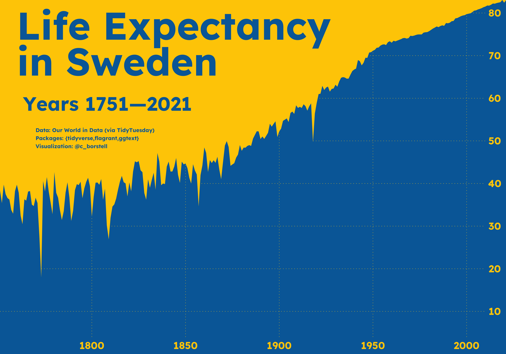

# Alt-text: A filled line chart of life expectancy in Sweden (years 1751—2021). The filled area showing the increase over time is in a mid-blue color on a gold yellow background (i.e. the colors of the Swedish flag). General increase over time with a few sudden drops during the 19th century and early 20th century. Data: Our World in Data (via TidyTuesday). Packages: {tidyverse,flagrant,ggtext}. Visualization: @c_borstell.
