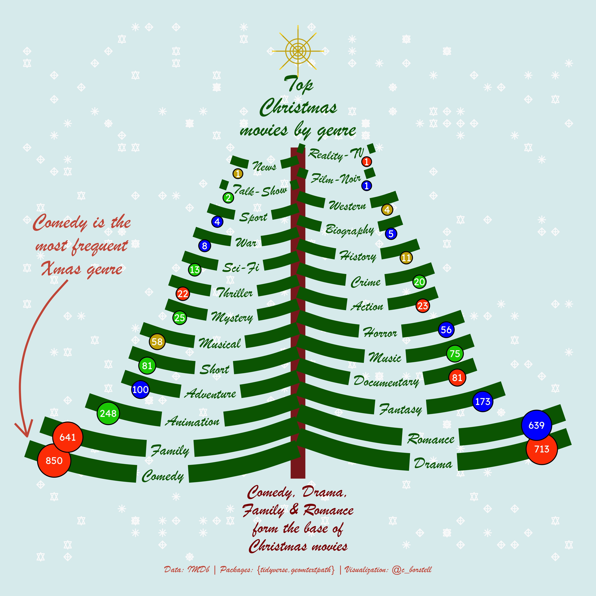

Alt-text: A graphic in the shape of a Christmas tree reading "Top Christmas movies by genre", read from least common genre (top) to most common (bottom). The lengths of the branches signal frequency of the genre: the longer (at the bottom), the more frequent. Each branch also contain the name of the genre. The bottom text reads "Comedy, Drama, Family & Romance form the base of Christmas movies". Caption: "Data: IMDb; Packages: {tidyverse,geomtextpath}; Visualization: @c_borstell". From each branch, there are Xmas decoration balls in various colors, each containing the number of movies in the genre of the corresponding branch. The background is light blue with white snowflakes.
