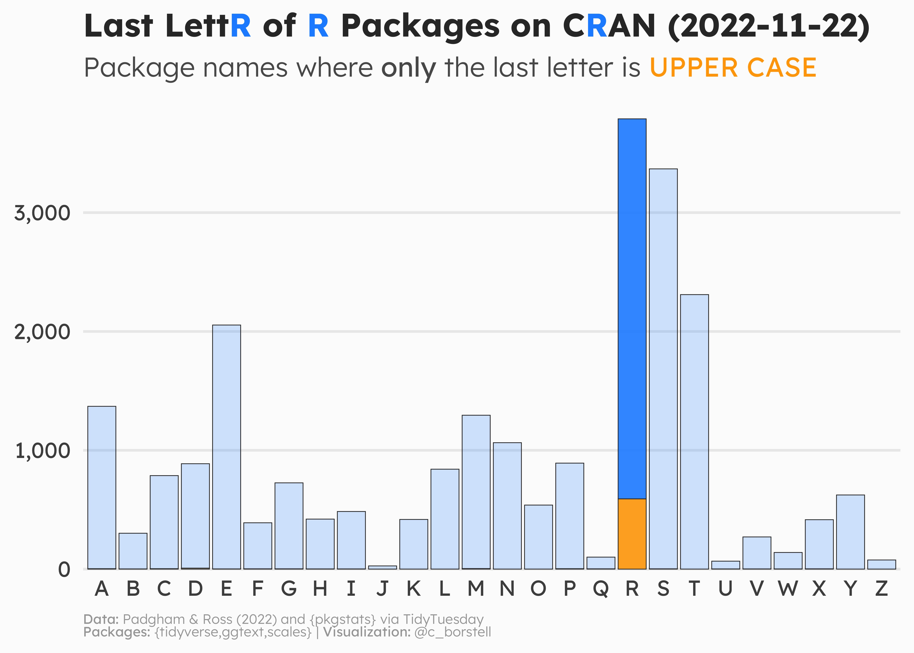

Alt-text: A bar chart showing the Last Letter of Packages on CRAN (2022-11-22). Package names where only the last letter is UPPER CASE are marked in yellow. The letter "R" is the most frequent last letter of R package names, many of which only has the final R as an upper case letter. Data:Padgham & Ross (2022) and {pkgstats} via TidyTuesday; Packages: {tidyverse,ggtext,scales}; Visualization: @c_borstell.
