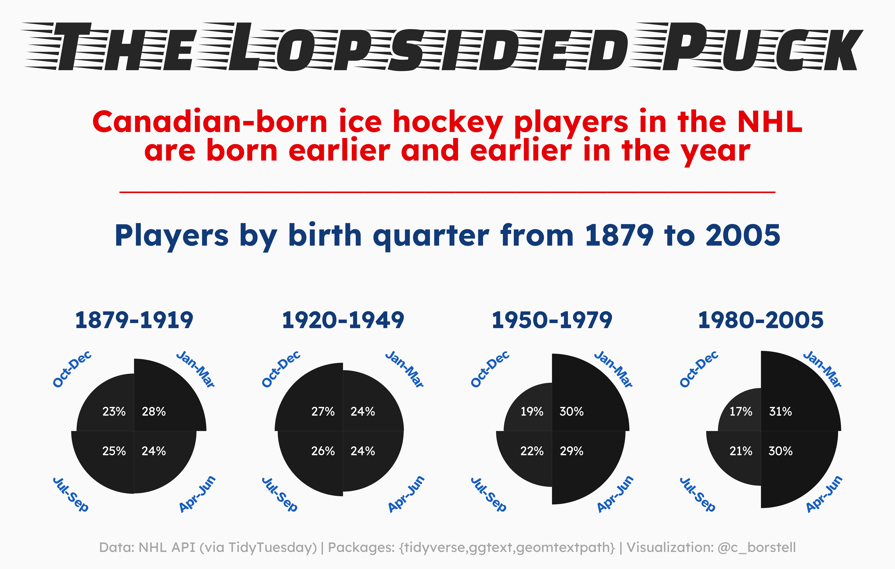

Alt-text: An graph showing the birth quarter of Canadian-born ice hockey players in the NHL, illustrating that in more recent years they are increasingly born in the first quarter/half of the year. The data are visualized as black pucks for each ~30-year interval (from 1879 to 2005) with each quarter sticking out more if more births are in that quarter. Data: NHL API (via TidyTuesday) | Packages: {tidyverse,ggtext,geomtextpath} | Visualization: @c_borstell. The color scheme is that of an ice hockey rink, icy-white background with red and blue text.
