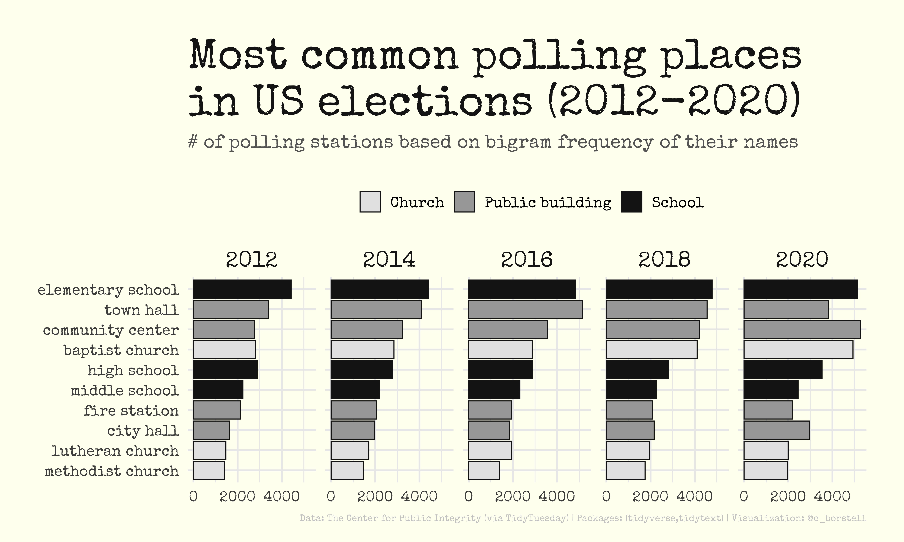

Alt-text: A graph in the style of an older document typed on a typewriter (yellowish paper, grey/black letters in a typewriter font) showing the Most common polling places in US elections (2012-2020), the number of polling stations based on bigram frequency of their names. The top 10 places shown are divided into three categories: Church, Public building and School. The most comment polling station categories are elementary schools, town halls and community centers. Data: The Center for Public Integrity (via TidyTuesday); Packages: {tidyverse,tidytext}; Visualization: @c_borstell.
