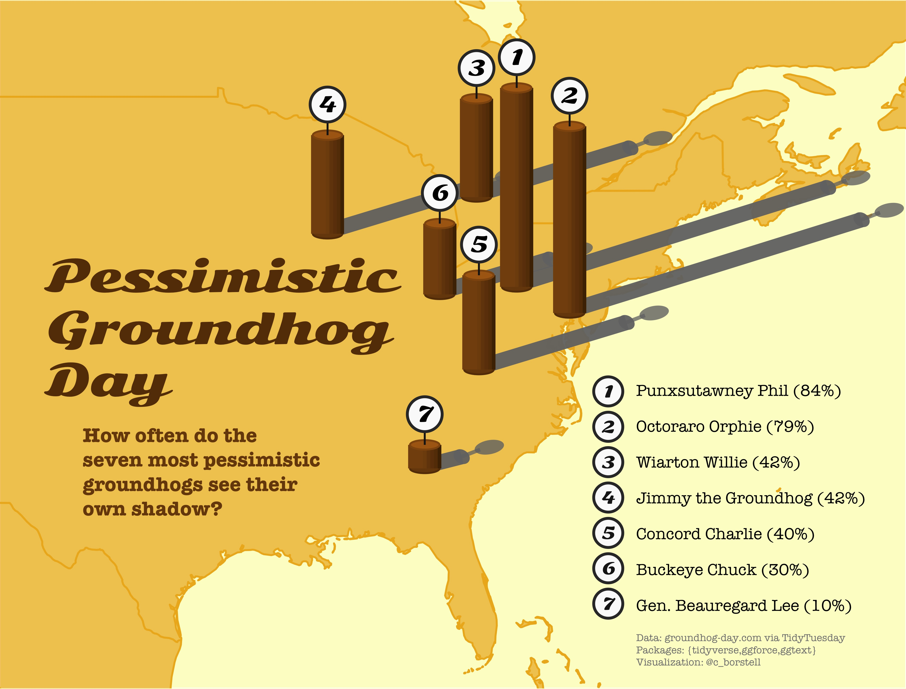

Alt-text: A map over the eastern parts of USA and Canada in a yellow, sunset-like color scheme, titled "Pessimistic Groundhog Day: How often do the seven most pessimistic groundhogs see their own shadow?" Each datapoint is represented by a wooden log rising up from the location of that groundhog, each casting a shadow to the east. The ranking is: Punxsutawney Phil (84%), Octoraro Orphie (79%), Wiarton Willie (42%), Jimmy the Groundhog (42%), Concord Charlie (40%), Buckeye Chuck (30%), General Beauragard Lee (10%). Data: groundhog-day dot com; Packages: tidyverse, ggforce, ggtext; Visualization: @c_borstell
