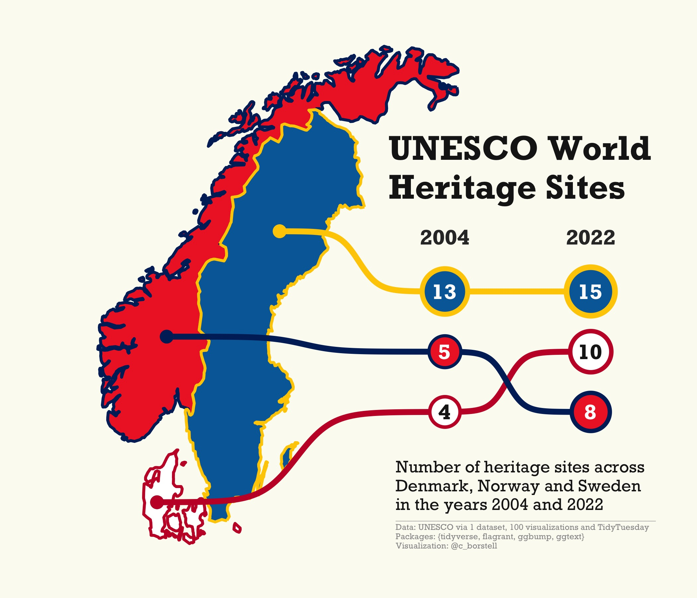

Alt-text: A map of the three Scandinavian countries (Denmark, Norway, Sweden) in the colors of their respective flags. The title reads "UNESCO World Heritage Sites" and has the subcaption "Number of heritage sites across Denmark, Norway and Sweden in the years 2004 and 2022". Linked to each country is a line that connects to dots representing the ranking of the number of heritage sites in each country, Sweden ranking first in both 2004 and 2022 and Denmark surpassing Norway from 2004 to 2022. Data: UNESCO via 1 dataset, 100 visualizations and TidyTuesday; Packages: {tidyverse, flagrant, ggbump, ggtext}; Visualization: @c_borstell
