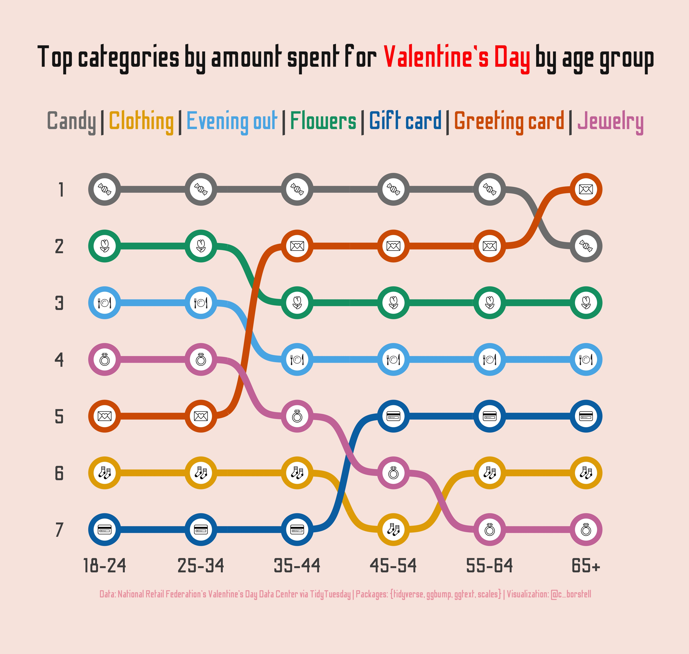

Alt-text: Graphic on a light pink background, showing "Top categories by amount spent for Valentine's Day by age group". Candy is the top category across all age groups apart from the oldest (65+), for which gift cards is number 1. Jewelry is the category that drops steadily as ages increase. Data: National Retail Federation's Valentine's Day Data Center via TidyTuesday | Packages: {tidyverse, ggbump, ggtext, scales} | Visualization: @c_borstell
