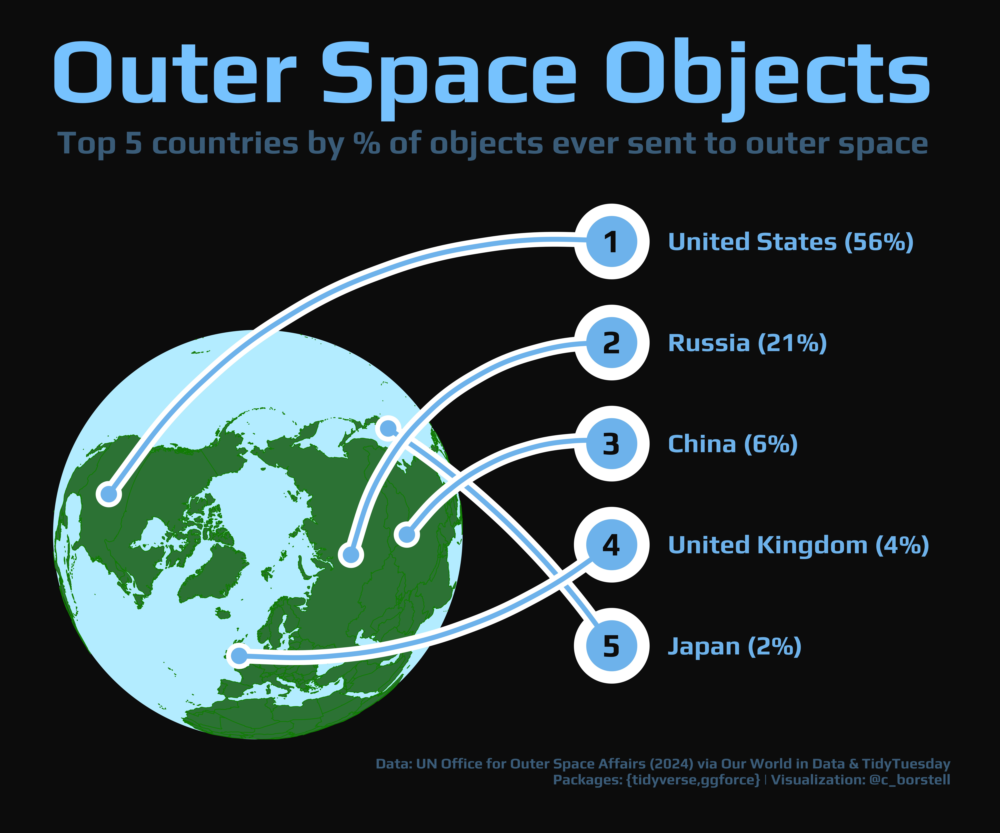

Alt-text: An infographic with the title "Outer Space Objects: Top 5 countries by % of objects ever sent to space". The plot looks like a dark space with the Earth in the bottom left corner. On the right, the top 5 countries are listed (United States 56%, Russia 21%, China 6%, UK 4%, Japan 2%) with lines drawn from the respective countries onto the countries listed, as if a launch path. Data: UN Office for Outer Space Affairs (2024) via Our World in Data & TidyTuesday; Packages: {tidyverse,ggforce}; Visualization: @c_borstell
