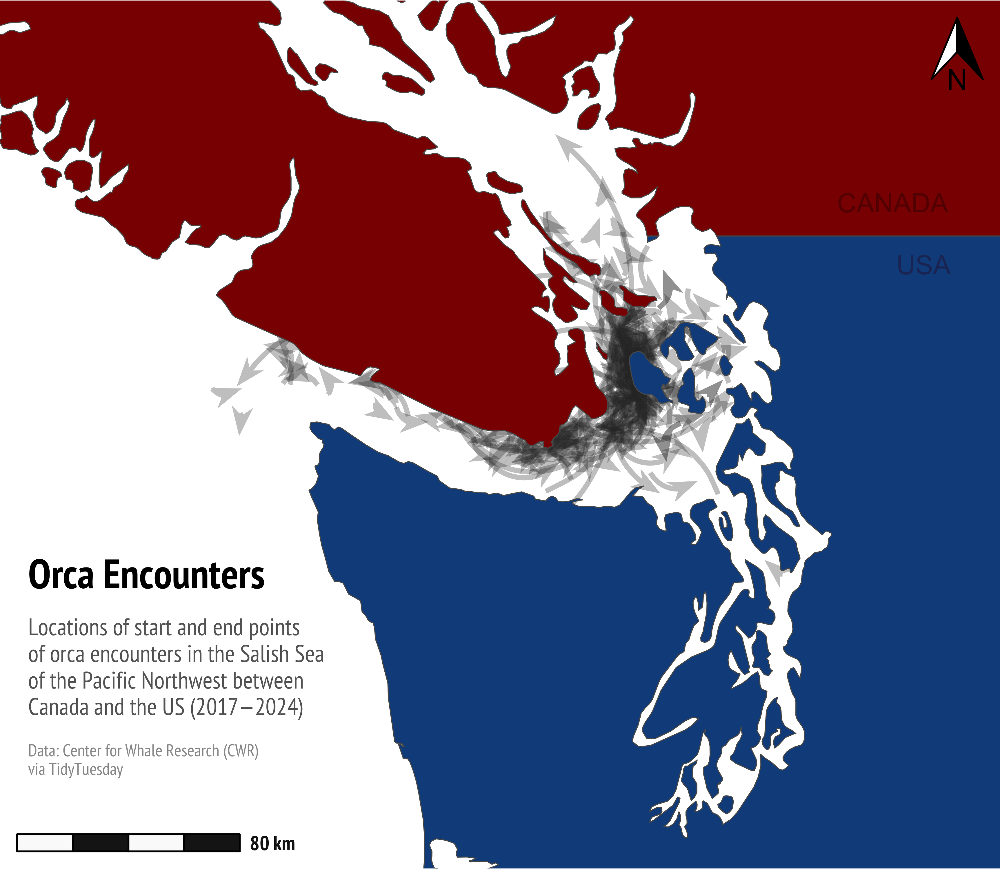

Alt-text: Map of the Salish Sea between the US and Canada, with curved arrows around the bay. "Orca Encounters: Locations of start and end points of orca encounters in the Salish Sea the Pacific Northwest between Canada and the US (2017—2024). Data: Center for Whale Research (CWR) via TidyTuesday."
