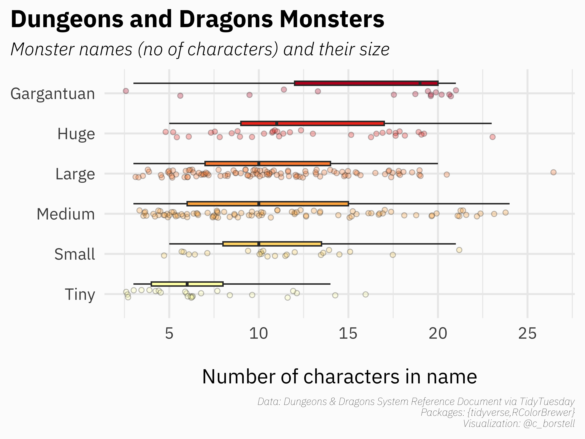

Alt-text: A horizontal boxplot and scatterplot showing the size of Dungeons & Dragons monsters and the length of their names (in number of characters). From the top down, Gargantuan, Huge, Large, Medium, Small and Tiny. There is a pattern of longer names being more prominent among larger monsters. Data: Dungeons & Dragons System Reference Document via TidyTuesday. Packages: {tidyverse,RColorBrewer} Visualization: @c_borstell.
