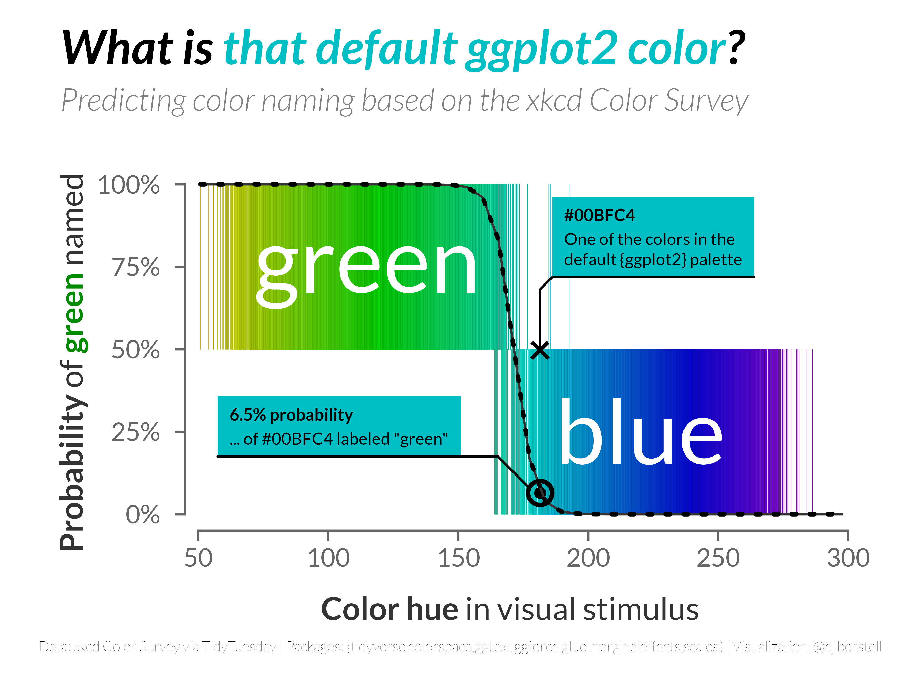

Alt-text: A two-dimensional plot with the title "What is that default ggplot2 color?: Predicting color naming based on the xkcd Color Survey". The x-axis shows color hue, with more green colors on the left and more blue colors on the right. The y-axis shows the predicted probability of "green" being used as label for the color hue in the visual stimulus. Each survey response is organized by its hue in the visual stimulus (x-axis) and whether the label is green (top) or blue (bottom) on the y-axis. There is an overlaid line drawn to show the model's predicted probability of a color label being used at various hue points, with a sharp shift from "green" to "blue" around the middle (hue about 165). The ggplot2 default color is slightly to the right, indicating that it is predicted as "blue", with the model predicting only 6.5% of "green" responses for this hue. Caption reads "Data: xkcd Color Survey via TidyTuesday | Packages: {tidyverse,colorspace,ggtext,ggforce,glue,marginaleffects,scales} | Visualization: @c_borstell."
