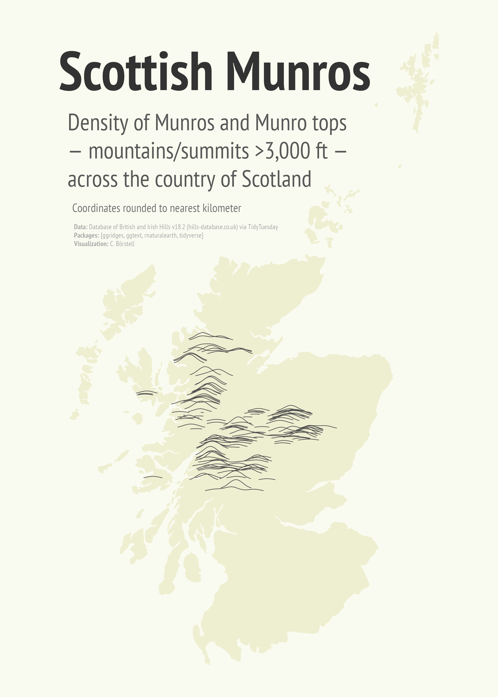

Alt-text: Light yellow-hue map of Scotland with smoothed, dark gray ridgelines showing the density of Munros and Munro tops by location, mainly in the Highlands. Title reads "Scottish Munros" with the description "Density of Munros and Munro tops — mountains/summits >3,000 ft — across the country of Scotland. Coordinates rounded to nearest kilometer. Data: Database of British and Irish Hills v18.2 (hills-database.co.uk) via TidyTuesday; Packages: {ggridges, ggtext, rnaturalearth, tidyverse}; Visualization: C. Börstell 
