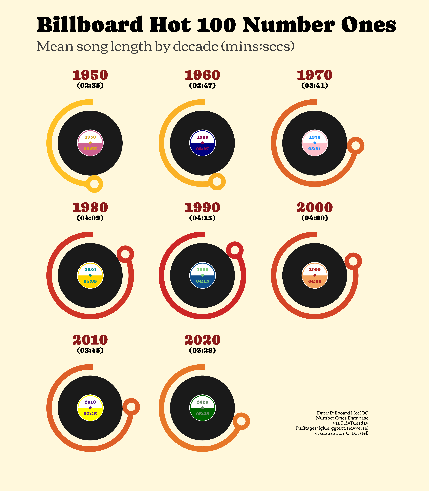

Alt-text: Billboard Hot 100 Number Ones: Mean song length by decade (mins:secs). A visualization showing each decade 1950 to 2020 as an LP vinyl record with a curved line at its circumference showing the mean song length per decade. Songs averaged under 3 mins in the 1950s-60s, increased to around 4 mins in the 1980s-2000s, then decreased to around 3.5 mins in the 2010s-20s. Data: Billboard Hot 100 Number Ones Database via TidyTuesday; Packages: {glue, ggtext, tidyverse}; Visualization: C. Börstell 
