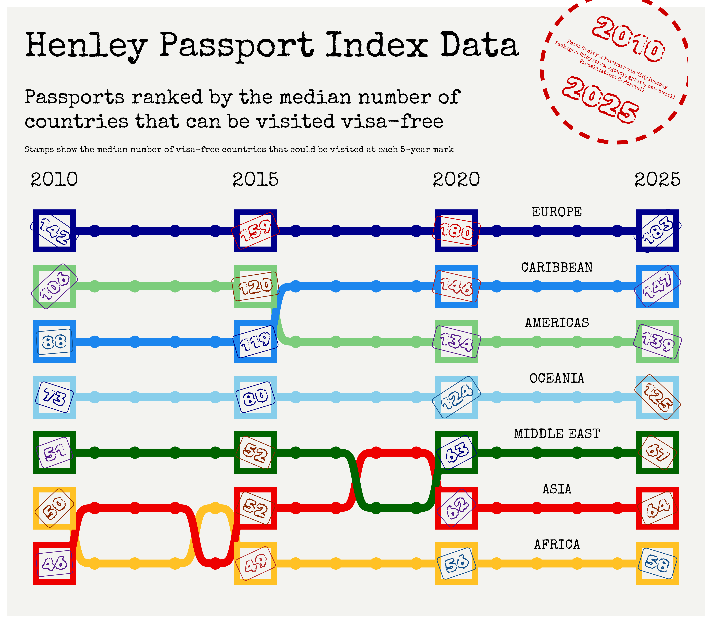

Alt-text: A graph titled "Henley Passport Index Data" explaining "Passports ranked by the median number of countries that can be visited visa-free: Stamps show the median number of visa-free countries that could be visited at each 5-year mark". Each region (Europe, Caribbean, Americas, Oceania, Middle East, Asia, Africa) is represented by a bump chart along the x-axis, with Europe ranking at the top from 2010 to 2025, followed by Caribbean, Americas, Oceania, Middle East, Asia and Africa. Caribbean overtook Americas in 2015; Africa, Asia and Middle East switching rankings a few times. Each 5-year mark shows the median number of visa-free countries that year for the region, stylized as a stamp in a box (differing in angles). The top right corner features a round red stamp with 2010-2025 and the text "Data: Henley & Partners via TidyTuesday; Packages: {tidyverse, ggbump, ggtext, patchwork}; Visualization: C. Börstell"
