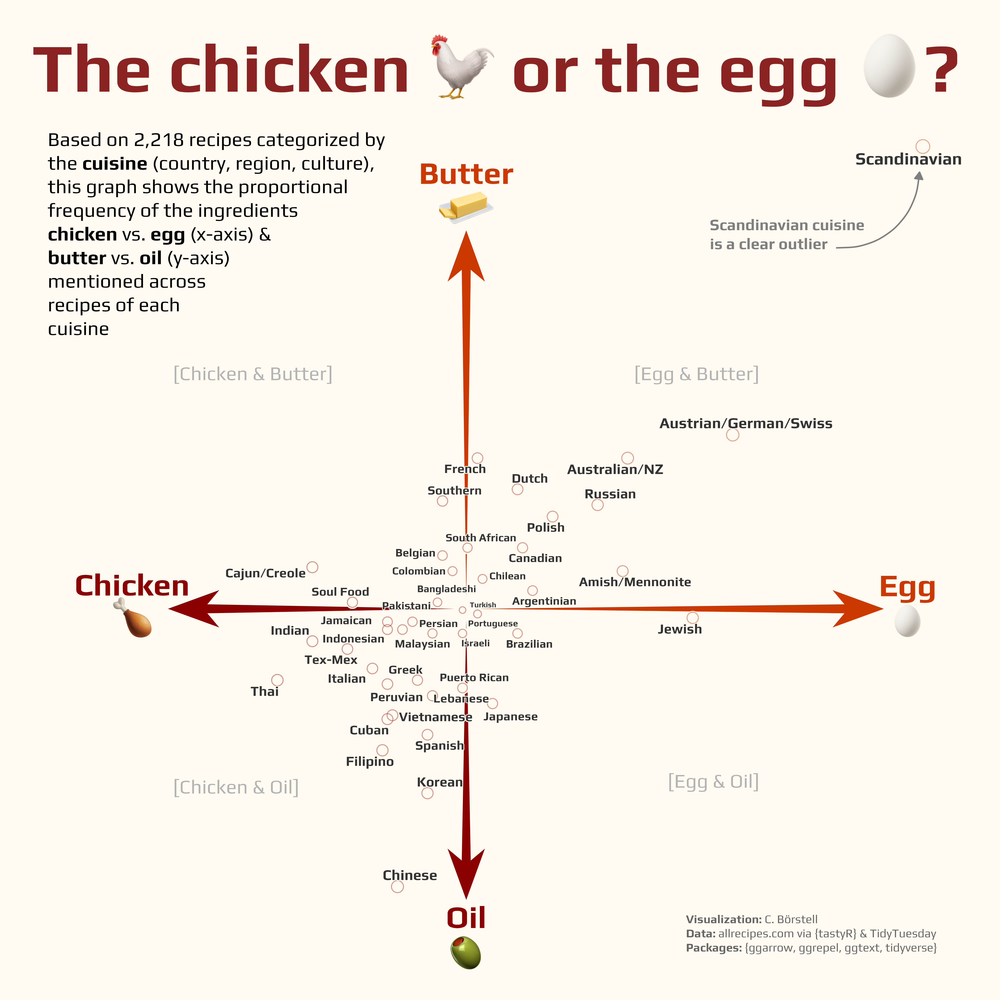

Alt-text: A scatterplot on a cream white background with the title "The chicken 🐓  or the egg 🥚?". The square grid is split by four reddish arrows pointing outwards north/south/east/west. A textbox in the top left reads "Based on 2,218 recipes categorized by country of origin, this graph shows the proportional frequency of chicken vs. egg (x-axis) & butter vs. oil (y-axis) mentioned across recipes of each cuisine.". Each point and text in the plot indicates where on a scale from chicken (left) to egg (right) and butter (top) to oil (bottom) the cuisine is located. Turkish is found at the very center of the plot, Chinese and Thai in the bottom left (chicken & oil), whereas Austrian/German/Swiss and particularly Scandinavian are in the top right (egg & butter). An arrow points at the top right data point saying "Scandinavian cuisine is a clear outlier". Visualization: C. Börstell; Data: allrecipes.com via {tastyR} & TidyTuesday; Packages: {ggarrow, ggrepel, ggtext, tidyverse}
