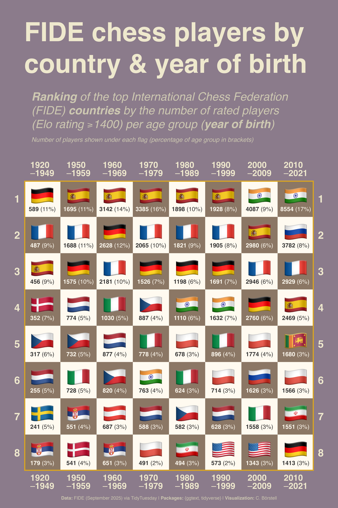

Alt-text: A plot titled "FIDE chess players by country & birth year: Ranking of total number of rated International Chess Federation (FIDE) chess players (ELO rating ⩾1400) per federation/country and the players' birth year. Numbers under the flags show the number of players (with percentage of totals in brackets)". The plot resembles a chessboard, with a brownish background and the rankings being displayed as country flags on top of the chessboard's squares. In the oldest age brackets (left side), European countries are dominating with Germany, Spain and France having the most players. On the right side with the younger age groups, India is quickly rising to the top, in the youngest age group (2010—2021), Sri Lanka is also up-and-coming. Data: FIDE (September 2025) via TidyTuesday; Packages: {ggtext, tidyverse}; Visualization: C. Börstell
