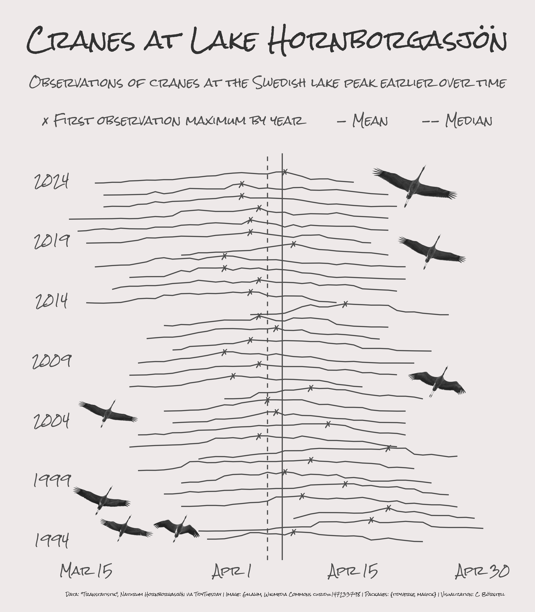

Alt-text: A data visualization in the style of handwritten/-drawn notes on a piece of paper. Title reads "Cranes at Lake Hornborgasjön: Observations of cranes at the Swedish lake peak earlier over time". The graph shows ridgelines along dates from mid-March to end of April (x-axis) across the years 1994 to 2024 (y-axis). The first date each year where that year's maximum number of observations was reached is marked with a little handdrawn X on the year ridgelines. Across all years, there are lines showing the mean and median values for first max observations across years down the middle. X'es are generally farther to the right in early years (i.e. later in the spring) and farther to the left in more recent years (earlier in the spring). In the plot margins, there are embedded images of cranes in flight. Data: "Transtatistik", Naturum Hornborgasjön via TidyTuesday; Image: Gllawm, Wikimedia Commons curid=147233798; Packages: {tidyverse, magick}; Visualization: C. Börstell
