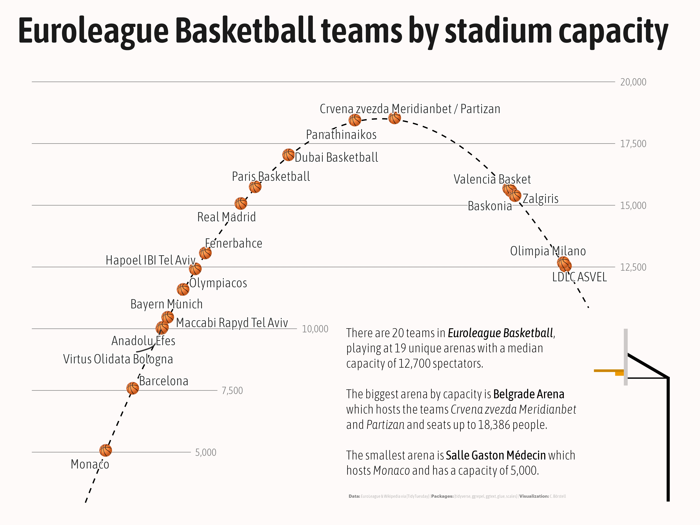

Alt-text: A plot that says Euroleague Basketball teams by stadium capacity on a offwhite background and black/gray text. Each data point is plotted as a basketball (emoji) and text label with the name of the team(s) playing at the arena, along a parabola simulating the trajectory of a basketball shot towards a schematic basketball hoop located in the bottom right corner. A caption reads: "There are 20 teams in Euroleague Basketball, playing at 19 unique arenas with a median capacity of 12,700 spectators. The biggest arena by capacity is Belgrade Arena which hosts the teams Crvena zvezda Meridianbet and Partizan and seats up to 18,386 people. The smallest arena is Salle Gaston Médecin which hosts Monaco and has a capacity of 5,000. Data: EuroLeague & Wikipedia via {TidyTuesday}; Packages: {tidyverse, ggrepel, ggtext, glue, scales} ; Visualization: C. Börstell."
