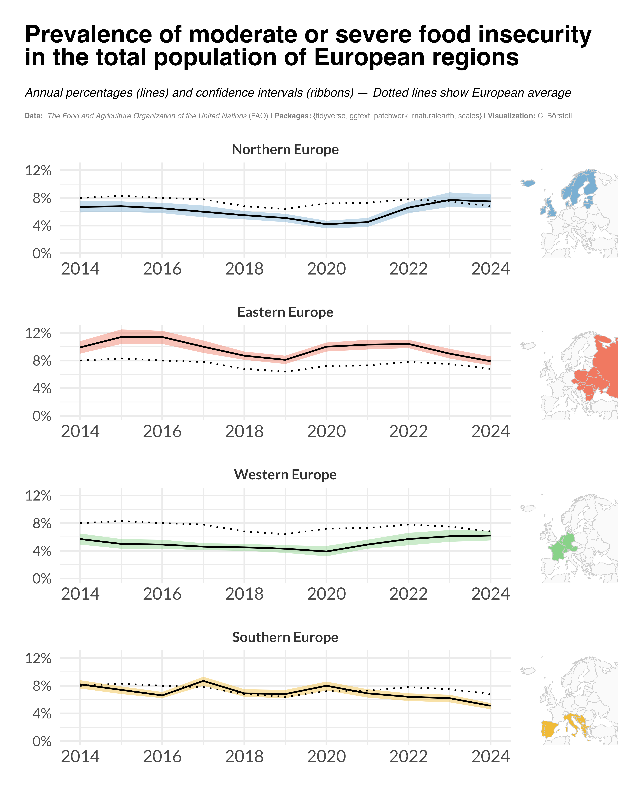

Alt-text: A plot showing the "Prevalence of moderate or severe food insecurity in the total population of European regions (Northern, Eastern, Western, Southern)" as line charts from 2014 to 2024. Annual percentages (lines) and confidence intervals (ribbons) — Dotted lines show European average. Data: The Food and Agriculture Organization of the United Nations (FAO); Packages: {tidyverse, ggtext, patchwork, rnaturalearth, scales}; Visualization: C. Börstell. Next to each line chart is a map of Europe with the relevant countries (of the area) filled in with a color coding.
