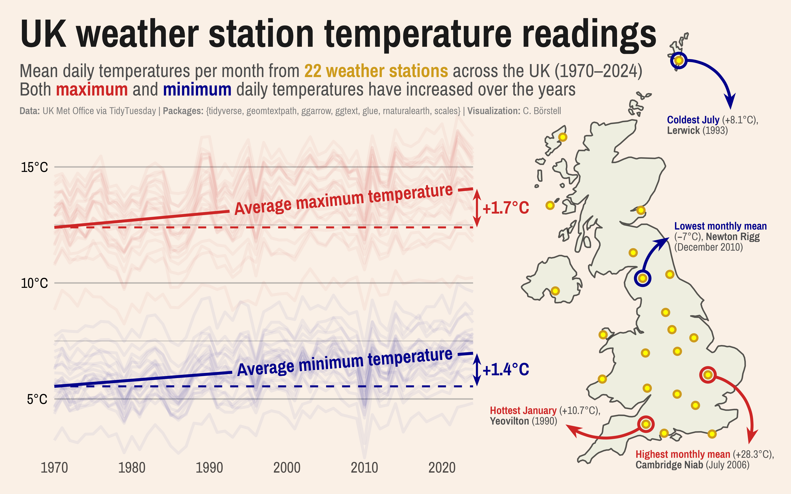

Alt-text: A line chart showing temperature changes (daily min and max readings) from 22 weather stations across the UK. The line charts include model fit lines showing average temperatures across stations over time (1970 to 2024), showing the estimated average increase at the right margin (about +1.5 degrees Celsius). On the right of the line chart, there is map of the UK showing the location of each weather station. Four of them are marked with annotations showing the highest (Cambridge, 2008) and lowest (Newton Rigg, 2010) monthly means and the hottest January (Yeovilton, 1990) and coldest July (Lerwick, 1993). Data: UK Met Office via TidyTuesday; Packages: {tidyverse, geomtextpath, ggarrow, ggtext, glue, rnaturalearth, scales}; Visualization: C. Börstell.
