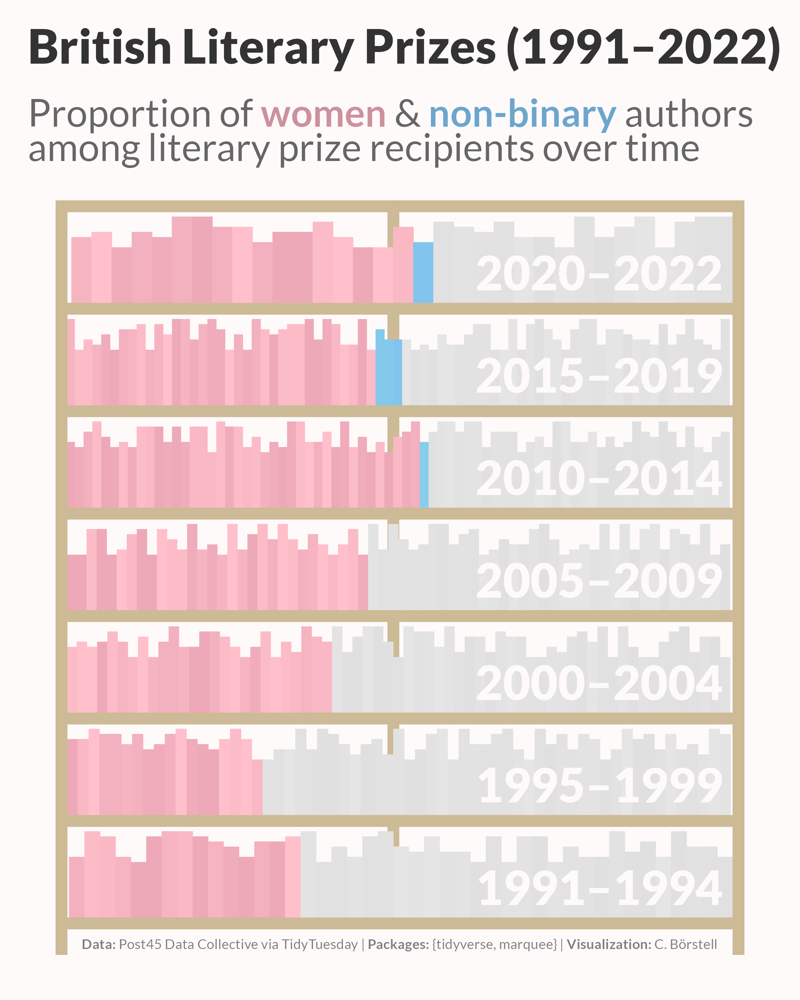

A plot with the title "British Literary Prizes (1991-2022): Proportion of women & non-binary authors among literary prize recipients over time". The plot is designed to resemble a bookcase, with each 5-year time period from 1991 to 2022 featured as a single shelf, and books representing individual prize recipients. Women and non-binary winners are color coded pink-ish and light blue-ish, respectively. Women and non-binary authors were in the minority until 2010–2014 and have constituted about half of the winners since then. Data: Post45 Data Collective via TidyTuesday; Packages: {tidyverse, marquee}; Visualization: C. Börstell.
