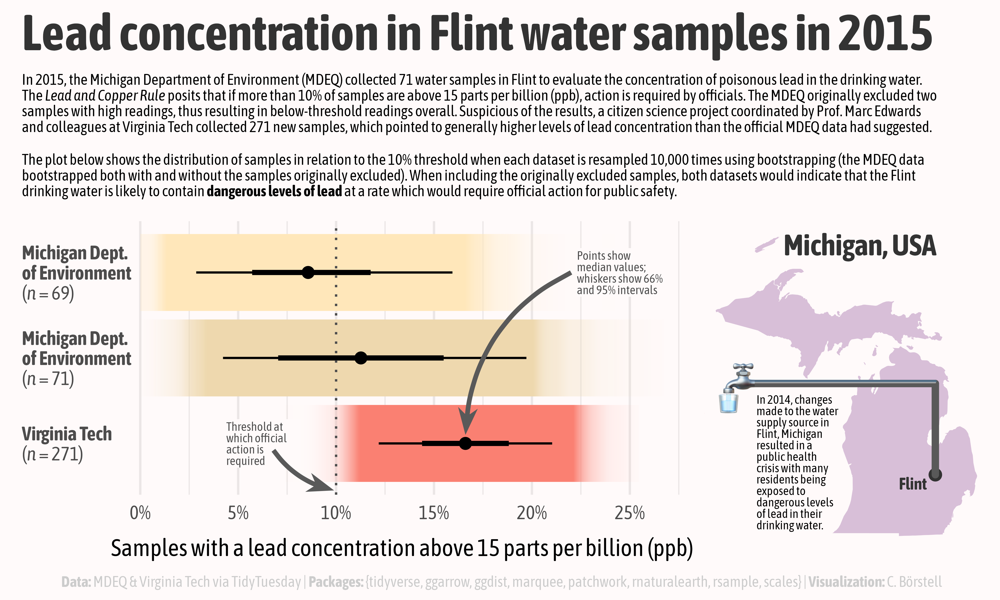

Alt-text: A plot with the title "Lead concentration in Flint water samples in 2015", consisting of a distribution plot (left) and a map of Michigan with Flint marked, with a water pipe coming out of Flint ending in a faucet emoji. The subtitle contains a longer text explaining "In 2015, the Michigan Department of Environment (MDEQ) collected 71 water samples in Flint to evaluate the concentration of poisonous lead in the drinking water. The Lead and Copper Rule posits that if more than 10% of samples are above 15 parts per billion (ppb), action is required by officials. The MDEQ originally excluded two samples with high readings, thus resulting in below-threshold readings overall. Suspicious of the results, a citizen science project coordinated by Prof. Marc Edwards and colleagues at Virginia Tech collected 271 new samples, which pointed to generally higher levels of lead concentration than the official MDEQ data had suggested. The plot below shows the distribution of samples in relation to the 10% threshold when each dataset is resampled 10,000 times using bootstrapping (the MDEQ data bootstrapped both with and without the samples originally excluded). When including the originally excluded samples, both datasets would indicate that the Flint drinking water is likely to contain dangerous levels of lead at a rate which would require official action for public safety. In 2014, changes made to the water supply source in Flint, Michigan resulted in a public health crisis with many residents being exposed to dangerous levels of lead in their drinking water. Data: MDEQ & Virginia Tech in Loux & Gibson (2018) via TidyTuesday | Packages: {tidyverse, ggarrow, ggdist, marquee, patchwork, raturalearth, rsample, scales}| Visualization: C. Börstell"
