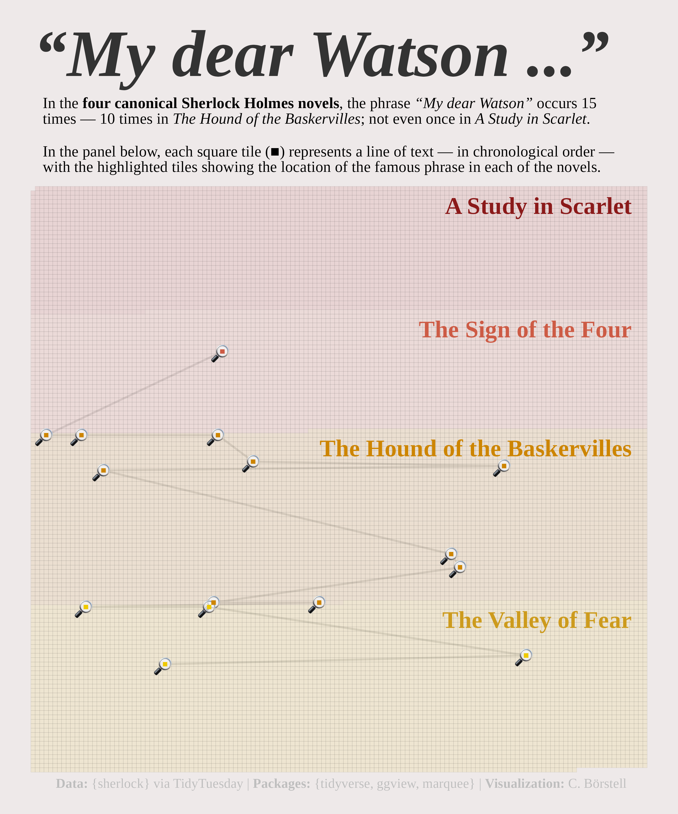

Alt-text: A chart with the title "My dear Watson ..." and subtitle caption "In the four canonical Sherlock Holmes novels, the phrase “My dear Watson” occurs 15 times — 10 times in "The Hound of the Baskervilles"; not even once in "A Study in Scarlet". In the panel below, each square tile (■) represents a line of text — in chronological order — with the highlighted tiles showing the location of the famous phrase in each of the novels." Each highlighted tile representing an occurrence of the phrase is marked with a magnifying glass and a path line tracing the chronological order of phrases across books. Data: {sherlock} via TidyTuesday; Packages: {tidyverse, ggview, marquee}; Visualization: C. Börstell
