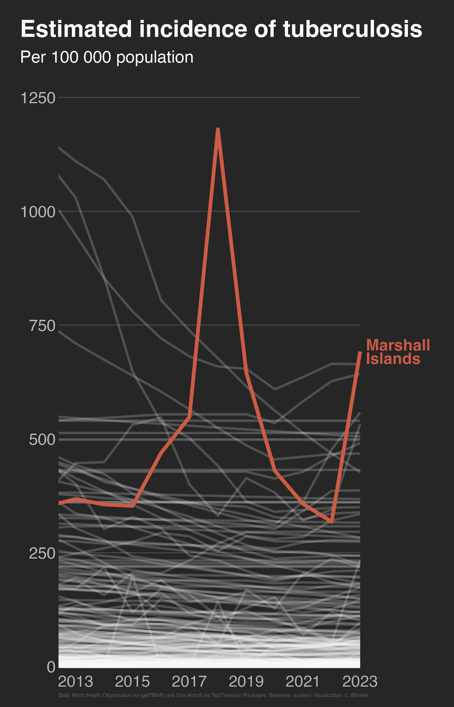

Alt-text: A line chart in the style of Chartle (a statistics guessing game) on a dark gray background with light gray/white text and lines, showing "Estimated incidence of tuberculosis per 100 000 population". One line is highlighted in coral red, showing the change for Marshall Islands from 2012 to 2023, with a huge surge from around 400/100k to well over 1000/100k in 2018. Data: World Health Organization via {getTBinR} and Sam Abbott via TidyTuesday; Packages: {tidyverse, scales}; Visualization: C. Börstell
