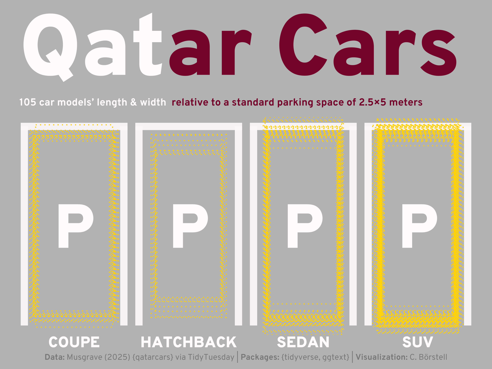

Alt-text: A plot titled "Qatar Cars: 105 car models' length & width relative to a standard parking space of 2.5×5 meters". Each car model's length and width is plotted as overlapping dotted line boxes relative to drawn white lines representing the size of a parking spot. Four different model types each have one parking space: coupe, hatchback, sedan and SUV. SUVs are borderline not fitting inside the parking space. Data: Musgrave (2025) {qatarcars} via TidyTuesday | Packages: {tidyverse, ggtext} | Visualization: C. Börstell.
