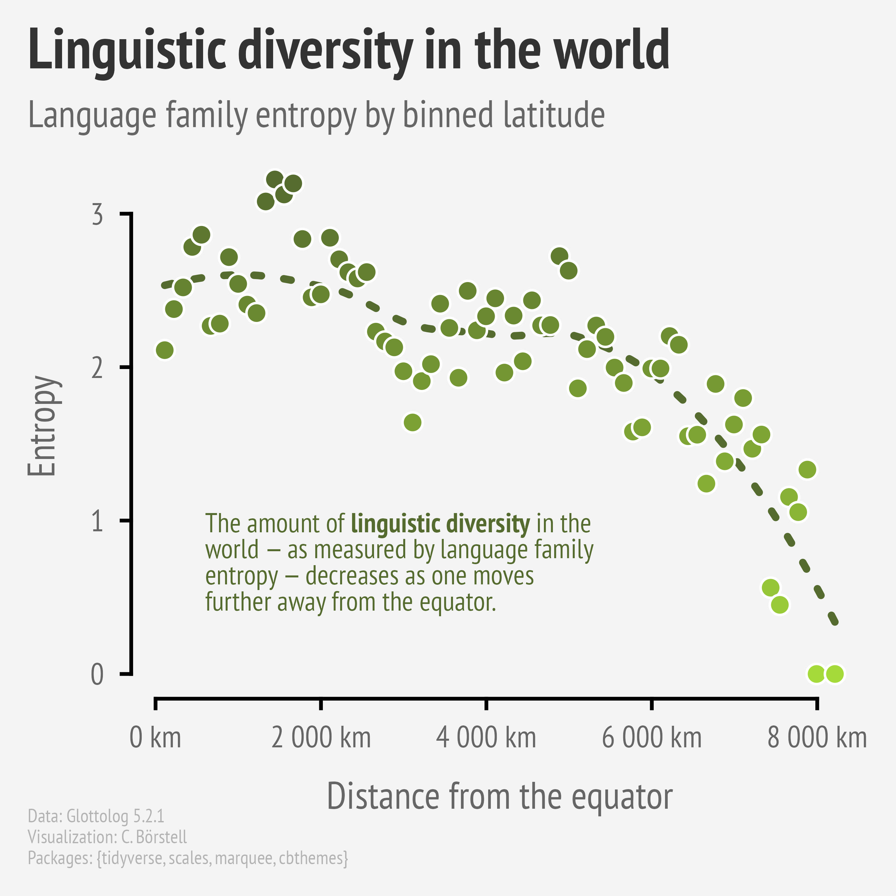

Alt-text: A scatterplot entitled "Linguistic diversity in the world: Language family entropy by binned latitude" showing that "The amount of linguistic diversity in the world — as measured by language family entropy — decreases as one moves further away from the equator." Data: Glottolog 5.2.1; Visualization: C. Börstell; Packages: {tidyverse, scales, marquee, cbthemes}
