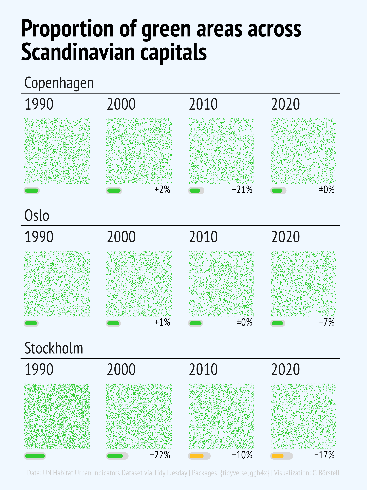

Alt-text: A small-multiples plot of the "Proportion of green areas across Scandinavian capitals: Copenhagen, Oslo and Stockholm". Each city has four panels - 1990, 2000, 2010, 2020 - showing a square of scattered green tiles representing the proportion of green areas. Below each square is an power bar-type plot showing each year's fill compared to the maximum across the 1990-2020 span, and next to it is a text label showing the percent change from the previous decade. While Oslo has had a quite stable level, Copenhagen lost a lot of relative green space in 2010, and Stockholm has been decreasing steadily and quite dramatically from the overall highest proportion in 1990, about half the proportion of 1990 in 2020. Data: UN Habitat Urban Indicators Dataset via TidyTuesday; Packages: {tidyverse, ggh4x}; Visualization: C. Börstell
