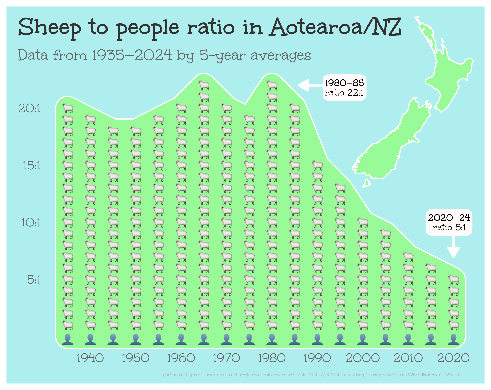

Alt-text: A graph with the title "Sheep to people ratio in Aotearoa/NZ: Data from 1935–2024 by 5-year averages" on a light blue background with a pale green area resembling land. The x-axis shows years by 5-year increments and the y-axis shows the rounded number of sheep per people. Between 1935 and 1980, the ratio is about 20:1, but then rapidly dropping to about 5:1 in the 2020s. The top corner shows an outline of Aotearoa. Caption reads: "Packages: {tidyverse, marquee, patchwork, rnaturalearth, rvest}; Data: StatsNZ & Statista via TidyTuesday & Wikipedia; Visualization: C. Börstell"
