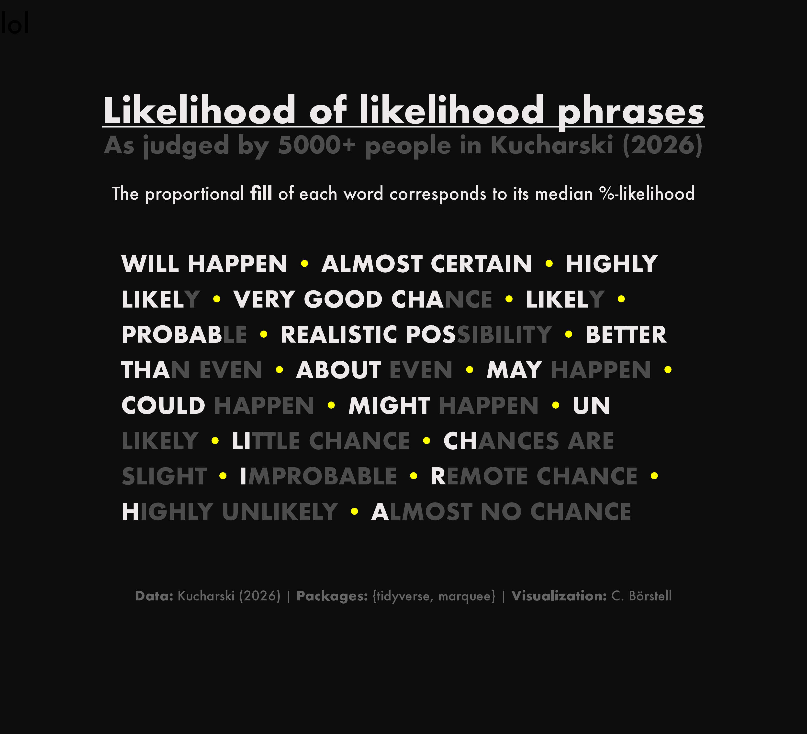

Alt-text: A black background with white/gray text with the title "Likelihood of likelihood phrases: As judged by 5000+ people in Kucharski (2026)". The proportional fill of each word corresponds to its median %-likelihood, from "Will Happen" and "Almost Certain" which are completely filled, to "Remote Chance", "Highly Unlikely" And "Almost No Chance" which are all almost completely unfilled. Data: Kucharski (2026); Packages: {tidyverse, marquee}; Visualization: C. Börstell.
