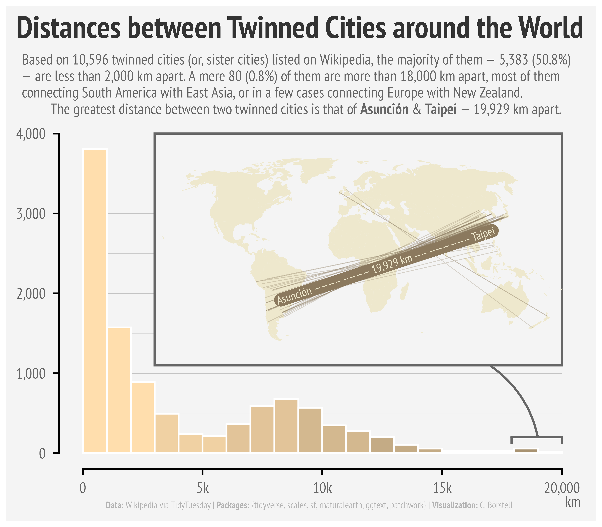

Alt-text: A histogram of "Distances between Twinned Cities around the World", with a world map inset in the top right. The caption reads: "Based on 10,596 twinned cities (or, sister cities) listed on Wikipedia, the majority of them — 5,383 (50.8%) — are less than 2,000 km apart. A mere 80 (0.8%) of them are more than 18,000 km apart, most of them connecting South America with East Asia, or in a few cases connecting Europe with New Zealand. The greatest distance between two twinned cities is that of Asunción & Taipei — 19,929 km apart."
