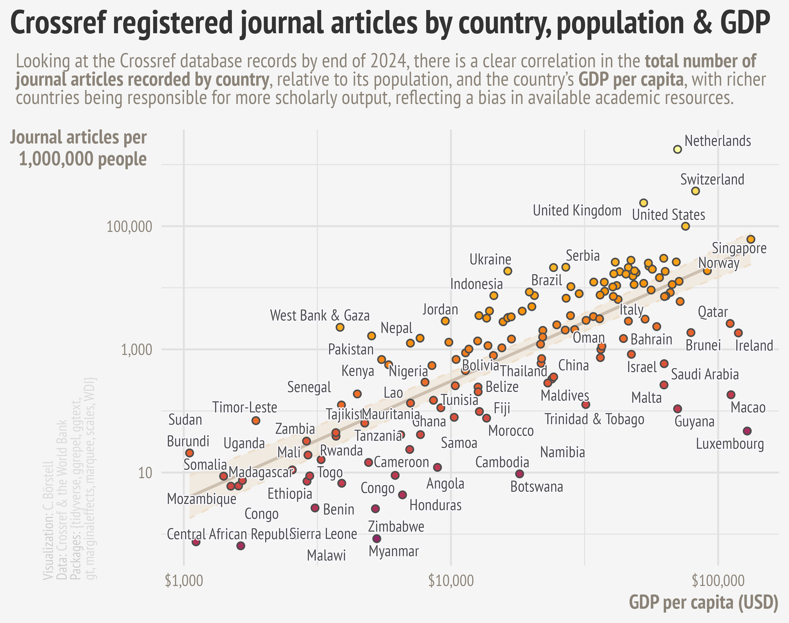

Alt-text: A scatterplot showing the number of Crossref registered journal articles by country, population & GDP, showing a log-linear correlation between journal articles published by 1 million people and GDP per capita, reflecting a bias in available academic resources.
