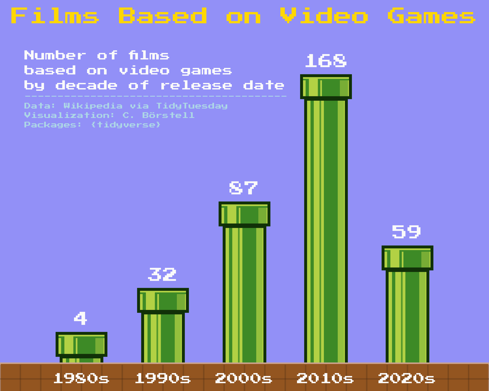

Alt-text: A bar chart in the style of an 8bit video game, with green pipes showing the bars of "Films Based on Video Games: Number of films based on video games by decade of release date". Data from Wikipedia via TidyTuessday. The graph shows a rapid increase from 4 and 32 films in the 1980s and 1990s, respectively, to 87 and 168 in the 2000s and 2010s, respectively, down to the (current decade) 2020s at 59.
